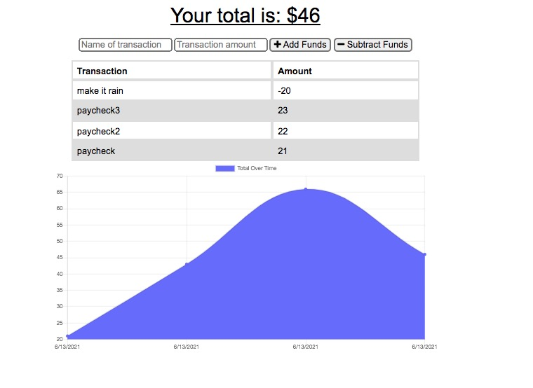

# Budget Tracker

## Description 

This budget tracking app helps users keep track on their spending, quickly and easily wherever they go. This application even offers users offline functionality for handling their finanacial information!

Users are can add and subtract amounts on their budget with or without internet connection. If users perform a transaction while offline, the transaction is stored, and loaded once they are back on the web. 

This web application is deployed on Heroku and the repository is on GitHub.
Heroku Deployment: [Budget Tracker](https://sleepy-sands-14482.herokuapp.com/)
[GitHub Repostitory](https://github.com/Clayto30/budget-tracker).

## Table of Contents (Optional)

* [Installation](#installation)
* [Usage](#usage)
* [Tests](#tests)
* [Credits](#credits)
* [License](#license)

## Installation

Simply visit the app's deployment URL on heroku, and start adding and subtracting amounts from your budget!

## Usage 

If you gain money, use the arrows to add that amount, name the transaction and click "Add Funds." Do the same for subtracting funds. Your total amount of money will be displayed and a graph will chart your history!

## Tests

Open the app in Chrome. Open Chrome Dev Tools and throttle the network at "Offline" under the "Network" tab. Then, go ahead an use the offline functionality of the app. Go ahead and submit a transaction. Then, switch the network throttling back from "Offline." The transaction will be posted! We have offline functionality!

## Credits

This project was created as a project as part of the UC Berkeley Coding Bootcamp instruction. My instructor and especially those ever-helpful TA's deserve special recognition.

## License

Copyright 2021 Clayton Goff

Permission is hereby granted, free of charge, to any person obtaining a copy of this software and associated documentation files (the "Software"), to deal in the Software without restriction, including without limitation the rights to use, copy, modify, merge, publish, distribute, sublicense, and/or sell copies of the Software, and to permit persons to whom the Software is furnished to do so, subject to the following conditions:

The above copyright notice and this permission notice shall be included in all copies or substantial portions of the Software.

THE SOFTWARE IS PROVIDED "AS IS", WITHOUT WARRANTY OF ANY KIND, EXPRESS OR IMPLIED, INCLUDING BUT NOT LIMITED TO THE WARRANTIES OF MERCHANTABILITY, FITNESS FOR A PARTICULAR PURPOSE AND NONINFRINGEMENT. IN NO EVENT SHALL THE AUTHORS OR COPYRIGHT HOLDERS BE LIABLE FOR ANY CLAIM, DAMAGES OR OTHER LIABILITY, WHETHER IN AN ACTION OF CONTRACT, TORT OR OTHERWISE, ARISING FROM, OUT OF OR IN CONNECTION WITH THE SOFTWARE OR THE USE OR OTHER DEALINGS IN THE SOFTWARE.